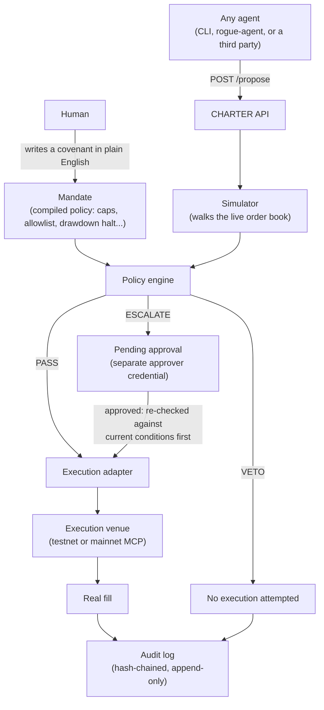

# CHARTER

CHARTER is a mandate and policy layer for AI trading agents on Binance. It is not a trading agent itself. Other agents' trade proposals have to pass through it before they can reach a Binance Agentic sub-account.

A human writes a covenant in plain English: spend caps, a symbol allowlist, leverage limits, a daily drawdown halt, a confirm-above-$X threshold. CHARTER compiles that into a live policy, simulates every proposal against real market data, and returns a real PASS, VETO, or ESCALATE verdict. Only a PASS, or an ESCALATE that a different person has approved, ever reaches execution. Every step is written to a hash-chained audit log.

Built for the Binance Agent OS Mini Hackathon, Track A.

The submission video shows the code at the [`v1.0-submission`](https://github.com/angelraph/charter/releases/tag/v1.0-submission) tag. One thing has changed since: an ESCALATE is no longer confirmed by re-running with `--execute`. It now needs a real approval from a different person, described under [Human approval](#human-approval).

## Motivation

Binance's own coverage of the Agent OS launch names the problem this project addresses. TechCrunch's headline on the announcement: "Binance now lets AI agents trade, but keeping them in check is largely up to users." CHARTER takes that responsibility off the user and puts it in an enforced, auditable policy instead.

## How it works



A proposal only ever reaches a real exchange through the execution adapter, and the execution adapter only ever runs on a PASS or an approved ESCALATE. A VETO stops at the policy engine, which is why a vetoed proposal has no execution entry in the audit log at all, not a failed one, a missing one.

## Agents

Each agent gets its own key, bound to the mandates it is allowed to use:

```bash
npx tsx src/index.ts agent add trader-1 --mandate <mandateId>
npx tsx src/index.ts agent list
npx tsx src/index.ts agent rotate trader-1
npx tsx src/index.ts agent revoke trader-1
```

The key is printed once and only its hash is stored. An agent sends it as `X-Charter-Api-Key`. From then on:

- Its identity is the key's, not whatever the request body says. A body naming a different agent is refused.
- It can only propose against its own mandates.
- It can only read its own results. Another agent's are reported as not found.
- Rotating replaces the key at once. Revoking stops it at once, and revoking the last agent does not reopen the API to unauthenticated callers.

The single shared `CHARTER_API_KEY` still works for a simple setup. Set `CHARTER_REQUIRE_AGENT_KEYS=true` to refuse it and accept only registered agents.

## Human approval

An ESCALATE is not confirmed by a flag on the same command. It opens a pending approval that someone other than the proposer has to grant, and the proposing agent can never grant it:

- The proposal stops at `ESCALATE` and returns an approval id. Passing `--execute` or `execute: true` does not change that.
- A separate credential is needed to decide. Agents use `CHARTER_API_KEY` to propose and to poll the outcome of their own escalation. Approving, rejecting, halting, or resuming needs `CHARTER_APPROVER_KEY`, plus an `X-Charter-Approver` header naming who is deciding. An agent that only holds the first key gets a 401 on every decision route.
- The approver cannot be the agent that submitted the proposal.
- Approvals expire (`CHARTER_APPROVAL_TTL_MINUTES`, default 10).
- Before anything executes, the proposal is evaluated again against current conditions: market, the day's spend, the drawdown baseline, and the kill switch. If it would now be vetoed, the approval is refused and the refusal is logged.
- The audit chain is verified before an approval is acted on, and each approval can be granted only once, including under simultaneous requests.
- The approver's identity is written into the audit log on the approval, the execution attempt, and the fill.

```bash
npx tsx src/index.ts approvals --status pending
npx tsx src/index.ts approve <approvalId> --approver alice --note "reviewed"
npx tsx src/index.ts reject <approvalId> --approver alice
```

Approvals and the kill switch are derived from the audit log itself rather than a separate store, the same way the day's spend is, so the state can never disagree with the record.

## Kill switch

`charter halt` vetoes every proposal, regardless of size or mandate, until `charter resume`. It also blocks an approval that was already granted but not yet executed, because the re-check sees the halt. Who halted, when, and why are recorded in the audit log, and the dashboard shows a banner while it is engaged.

```bash
npx tsx src/index.ts halt --reason "unusual fills"
npx tsx src/index.ts status
npx tsx src/index.ts resume
```

## Trust boundary

CHARTER only enforces anything if the agent has to go through it. It is a real boundary when CHARTER is the only holder of the exchange credentials and agents hold nothing but the proposing key. If an agent has its own Binance key, it can trade without CHARTER and nothing here stops it. Enforcement is a deployment property, not something the code can guarantee by itself.

What that setup protects against: an agent exceeding its limits, an agent approving its own escalation, replaying or double-executing an approval, acting on a stale approval, and tampering with the record afterward (detectable). What it does not protect against: someone with write access to the audit file who also recomputes every hash, a compromised CHARTER host, or an approver who approves something bad. The CLI runs with local access to the log, so the OS username is the identity it records. The API identity is whatever the holder of the approver key claims in `X-Charter-Approver`. There is still one shared approver key, so approvers are told apart by the name they claim, not by separate credentials. The full list of what is and is not defended against is in [docs/THREAT_MODEL.md](docs/THREAT_MODEL.md).

## Verdict reasons

A verdict is never a bare PASS, VETO, or ESCALATE label. Every `Verdict` carries a `reasons` array with one entry per policy rule that ran, each shaped as `{ rule, outcome, detail }` (`outcome` is `"ok"`, `"warning"`, or `"violated"`). This is the structured attribution behind the decision: which specific rule drove it, and why, not just the final outcome. It's produced by `evaluateProposal` in `src/policy/engine.ts`, which runs every rule and always returns the full result set regardless of decision; the shape itself is `RuleResult` in `src/policy/types.ts`.

Example, for a proposal that gets vetoed for exceeding the daily spend cap while every other rule passes:

```json
{
  "decision": "VETO",
  "reasons": [
    { "rule": "symbolAllowlist", "outcome": "ok", "detail": "BTCUSDT is on the allowlist for BUY" },
    { "rule": "dailySpendCapUsd", "outcome": "violated", "detail": "Today's spend $490 + this proposal $15 exceeds dailySpendCapUsd $500" },
    { "rule": "maxSlippageBps", "outcome": "ok", "detail": "Projected slippage 2.1bps is within 50bps limit" }
  ]
}
```

The CLI's `propose` command prints this array line by line (one of `✗` / `!` / `✓` per rule), the API returns it verbatim in the `POST /propose` and `GET /status/:id` responses, and it's written to the audit log unmodified as part of every `VERDICT_ISSUED` entry, so `audit tail` and `audit verify` show the same attribution that decided the trade.

## Execution venue

CHARTER always executes against a real order-matching engine. It never fabricates fills or simulation numbers. Which engine it uses depends on the `EXECUTION_VENUE` setting.

`testnet` is the default: [Binance Spot Testnet](https://testnet.binance.vision), a real matching engine with virtual funds, at zero cost. This is what development and most of the demo footage run against.

`mainnet-mcp` points at the real [Binance Agent OS MCP server](https://developers.binance.com/en/docs/agent-native/mcp-server), against a real, self-funded Agentic sub-account. It's used only where explicitly stated, with a small amount of real funds.

Every audit log entry records which venue produced it. Check `data/audit.log.jsonl` to see exactly which fills were testnet and which, if any, were mainnet.

## Setup

```bash
npm install
cp .env.example .env
```

Get testnet credentials by logging into https://testnet.binance.vision with GitHub, then fill in `BINANCE_TESTNET_API_KEY` and `BINANCE_TESTNET_API_SECRET` in `.env`.

```bash
npm run testnet:smoke
```

That command should print a real balance and a real live order book, proving the connection actually works before you go further.

## Usage

```bash
npx tsx src/index.ts init
npx tsx src/index.ts propose BTCUSDT BUY --usd 15
npx tsx src/index.ts propose BTCUSDT BUY --usd 15 --execute
npx tsx src/index.ts approvals --status pending
npx tsx src/index.ts halt --reason "unusual fills"
npx tsx src/index.ts mandate compile "Max 30 dollars per trade, spot only, halt at 8 percent drawdown"
npx tsx src/index.ts serve
npx tsx src/index.ts dashboard
npx tsx src/index.ts audit tail
npx tsx src/index.ts audit verify
```

`npm run rogue-agent` starts a separate process that submits a mix of compliant and violating proposals to a running `charter serve` instance, to demonstrate the veto working against a genuinely independent caller.

## Architecture

```
src/
  config.ts        env loading and validation
  mandate/         covenant schema, NL to policy compiler, mandate storage
  policy/          rule engine: evaluate(proposal, mandate, market) -> verdict
  market/          public market data, order-book simulator, NAV calculation
  venues/          ExecutionVenue interface, testnet and mainnet-mcp implementations
  execution/       PASS verdict to real order placement
  audit/           hash-chained, append-only audit log
  api/             local HTTP API other agents call: POST /propose
  cli/             CLI commands and the Ink terminal dashboard
  rogue-agent/     separate demo process that proposes trades, some violating policy
```

`venues/types.ts` defines the `ExecutionVenue` interface. That abstraction is what makes moving from testnet to mainnet a config change rather than a rewrite.

## License

MIT
